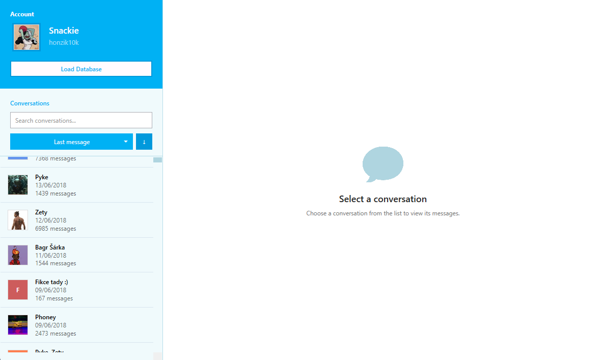
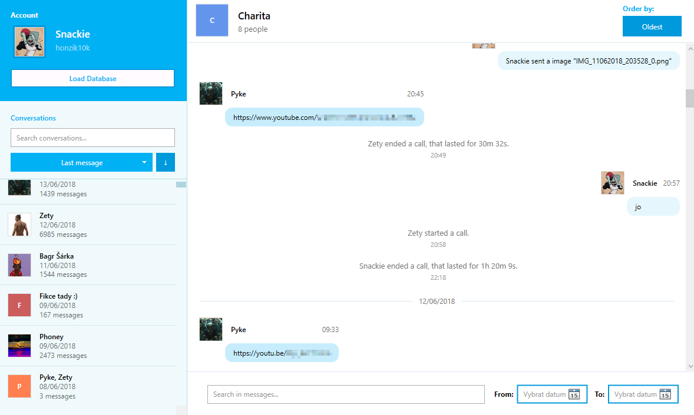

# Skype Conversations

Desktopová aplikace vytvořená v **C# a WPF** pro prohlížení archivovaných konverzací ze starších verzí Skype.

Aplikace umožňuje načíst lokální soubor `main.db` a zobrazit jeho obsah v přehledném rozhraní podobném klasickému Skype chatu.

> **Stav projektu:** Beta – některé funkce jsou stále ve vývoji.

---

## Funkce

- Načtení Skype databáze `main.db`
- Zobrazení uživatelského účtu
- Přehled všech konverzací
- Vyhledávání a řazení konverzací
- Zobrazení zpráv v podobě chatových bublin
- Postupné načítání starších zpráv při scrollování
- Informace o kontaktech
- Zobrazení různých typů zpráv
- Vyhledávání v konverzacích

## Ukázky

---

## Použité technologie

- **C#**
- **.NET**
- **WPF**
- **XAML**
- **SQLite**
- **MVVM**

---

## Použití

1. Stáhněte poslední verzi aplikace z [Releases](../../releases).
2. Spusťte `SkypeConvosReader.exe`.
3. Klikněte na **Load Database**.
4. Vyberte vlastní soubor `main.db`.
5. Procházejte archivované konverzace.

Aplikace neobsahuje žádnou přednastavenou Skype databázi. Databáze je vybrána uživatelem a zpracována lokálně.

---

## Stav projektu

Projekt je momentálně v **Beta** fázi.

Základní prohlížení databáze a konverzací je funkční, některé plánované funkce a úpravy uživatelského rozhraní ale ještě nejsou dokončené.
